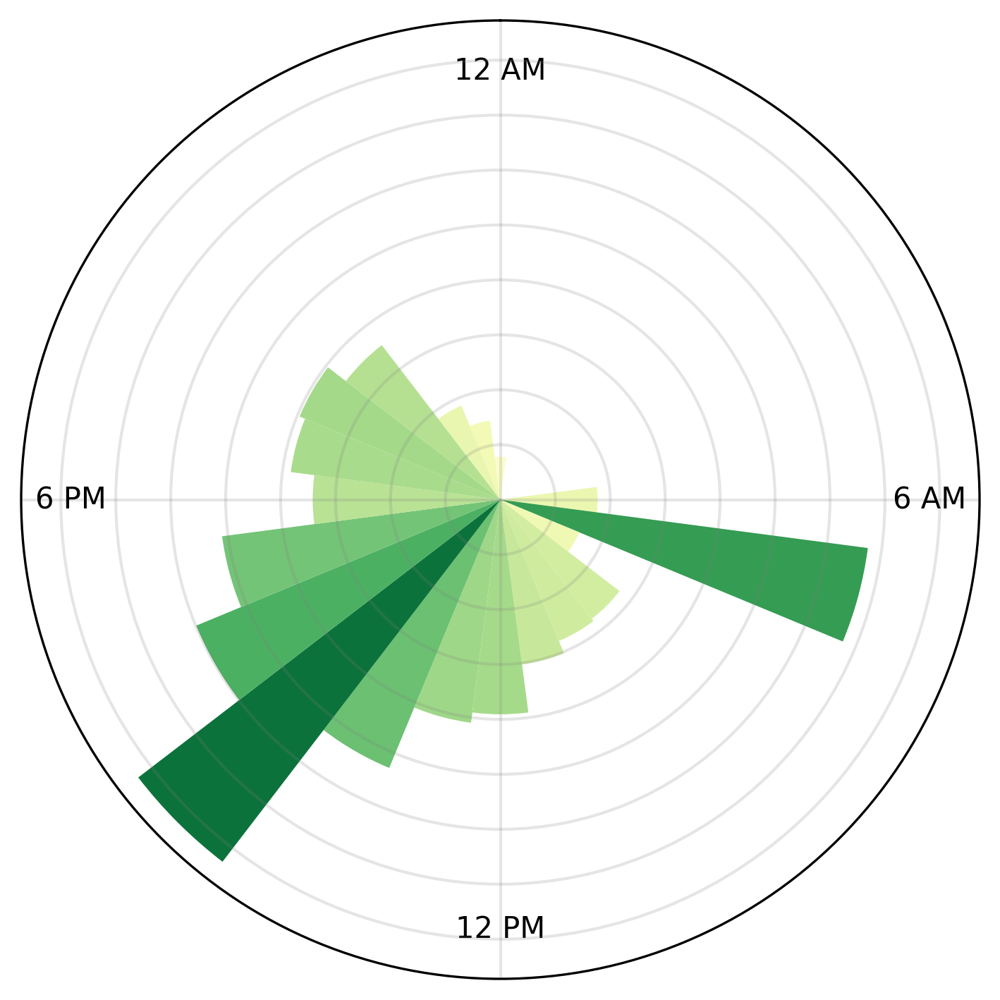

# Spotify Streaming Patterns

<!--  -->

### Data

The data in `/json` is from the extended streaming history & account data, from Spotify account privacy (see [Spotify Support](https://support.spotify.com/ca-en/article/data-rights-and-privacy-settings/)). Files with sensitive information (e.g. IP addresses) are ignored from this repositor, and the sanitized data is stored in `/csv`.

### Analysis Overview

- [`prepare.ipynb`](./prepare.ipynb) Preprocessing & Transforming  
- [`artists.ipynb`](./artists.ipynb) Artist Analysis  
  - Top artists 
  - Top tracks for top artists
  - Artist streaks
  - Concert analysis
- [`tracks.ipynb`](./tracks.ipynb) Song Analysis
  - Top tracks
  - Top single-day streams
  - Song streaks
- [`time.ipynb`](./time.ipynb) Streaming Analysis
  - Listening activity
  - Time of day analysis
  - Listening time across months
- [`more.ipynb`](./more.ipynb) Other Analysis
  - Genre analysis
  - Top skips, one-hit wonders
  - Library composition
- [`alltime.ipynb`](./alltime.ipynb) Analysis Across Years 

### Report

See [report.pdf](./report.pdf). Some excerpts from the analysis:

> Total streaming hours across each month in 2025 (dark), vs 2024 (light).

> 24-hour listening clock for 2025 (midnight at top, noon at bottom)

<!--  -->

> Top tracks of all time by streaming time

| Track                                 | Hours | Streams | Dates |
|---------------------------------------|-------|---------|-------|
| GONE, GONE / THANK YOU                | 26.7  | 319     | 213   |
| After The Storm                       | 13.7  | 266     | 205   |
| EARFQUAKE                             | 12.7  | 269     | 188   |
| I Know The End                        | 12.3  | 139     | 86    |
| Nettles                               | 12.1  | 112     | 43    |
| A BOY IS A GUN*                       | 11.6  | 239     | 170   |
| SWEET / I THOUGHT YOU WANTED TO DANCE | 11.3  | 117     | 89    |
| All Too Well (10 Minute Version)      | 10.6  | 82      | 69    |
| Best Friend                           | 10.2  | 162     | 86    |
| GRoCERIES                             | 9.8   | 189     | 116   |

