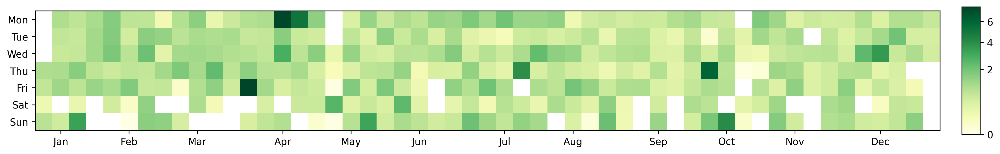
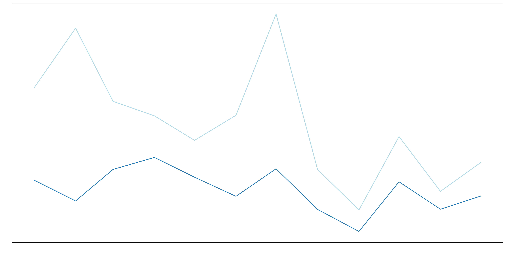

# Spotify Stats

<!--  -->

### Data

The data in `/json` is from the extended streaming history & account data, from Spotify account privacy (see [Spotify Support](https://support.spotify.com/ca-en/article/data-rights-and-privacy-settings/)). Files with sensitive information (e.g. IP addresses) are ignored from this repositor, and the sanitized data is stored in `/csv`.

### Analysis Overview

- [`prepare.ipynb`](./prepare.ipynb) Preprocessing & Transforming  
- [`artists.ipynb`](./artists.ipynb) Artist Analysis  
  - Top artists 
  - Top tracks for top artists
  - Artist streaks
  - Concert analysis
- [`tracks.ipynb`](./tracks.ipynb) Song Analysis
  - Top tracks
  - Top single-day streams
  - Song streaks
- [`time.ipynb`](./time.ipynb) Streaming Analysis
  - Listening activity
  - Time of day analysis
  - Listening time across months
- [`more.ipynb`](./more.ipynb) Other Analysis
  - Genre analysis
  - Top skips, one-hit wonders
  - Library composition
- [`alltime.ipynb`](./alltime.ipynb) Analysis Across Years 

### Report

See [report.pdf](./report.pdf).

> Total streaming hours across each month, compared to the monthly average (dotted).

